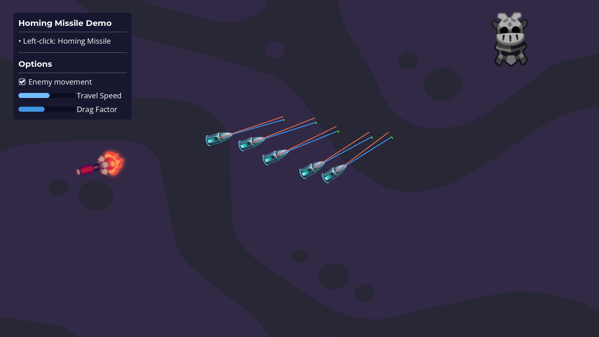

# Homing missiles

This Godot project shows how to implement homing missiles that follow their target within a range.

<!-- TODO: link to library -->
<!-- For a detailed guide to get you started with saving and loading in Godot, check out the GDQuest Library: [Saving and loading games in Godot 4 (with resources)](https://gdquest.com/library/save_game_godot4/) -->
